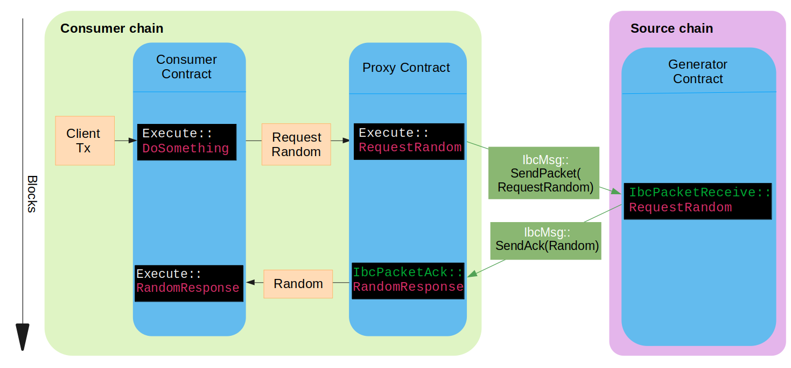

# Cross-Chain Random Numbers Demo

This repository contains a demo on how to use cross-chain random numbers from Secret Network to another chain via IBC. 

The system consists of two localsecret chains, that simulate Secret Network and a consumer chain. In addition, there are two smart contracts:

* **Proxy Contract**: Responsible for fetching the random number from Secret Network via IBC.
* **Consumer Contract**: A contract that represents an application on the consuming chain, which uses the random numbers generated by the proxy contract.

This demo provides an example of how to interact with the Proxy Contract to fetch random numbers, as well as a development playground for applications. The target audience are app developers on chains other than Secret Network who want to use random numbers in their apps.

In a real-world scenario, the proxy contract will be deployed once, and there will be many consuming contracts. The proxy contract will produce a *different, non-predictable* number for 
each request it receives. You can read more about random numbers on Secret Network in the [documentation](https://docs.scrt.network/secret-network-documentation/development/secret-contract-fundamentals/available-native-features-modules/secret-vrf-on-chain-randomness).

## Contracts

The Proxy Contract provides the RequestRandom function, which allows users to request a random number. The contract then sends the random number via IBC, which can be received using the RandomResponse function. The Consumer Contract is an example of how a user can interact with the Proxy Contract to request and receive random numbers.

Here are the main components of the Proxy Contract:

* RequestRandom: Requests a random number and specifies the callback information for the response.

The main components of the Consumer Contract are:

* DoSomething: Triggers a request for a random number from the Proxy Contract.
* RandomResponse: Receives the random number from the Proxy Contract and stores it in the Consumer Contract's storage.

In this example, the interaction with the proxy is done using callback methods. The consumer requests a random number, and the proxy will call the RandomResponse method of the 
calling contract once the number is available. This is an example of such an interface, and real-world implementation may differ.



### Build and Run Demo

#### Build Proxy and Consumer Images
```bash
make
```

#### Run (Run from the repository's root directory)
```bash
docker compose up
```

#### Interact with the Consumer Contract

The consumer contract exposes an interface to display the latest received random number, and request a new one.
You can access this web interface via the browser at:
```
http://localhost:8080
```
The endpoint will be available once the contract is instantiated.

### Use demo as a development playground

In the Consumer Contract, replace the logic with your own application logic.

Interact with the Proxy Contract to request and receive random numbers using the RequestRandom and RandomResponse functions.